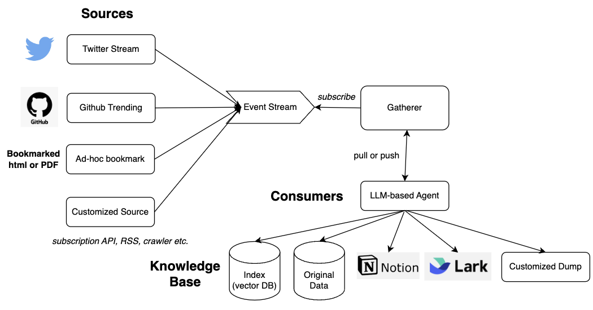
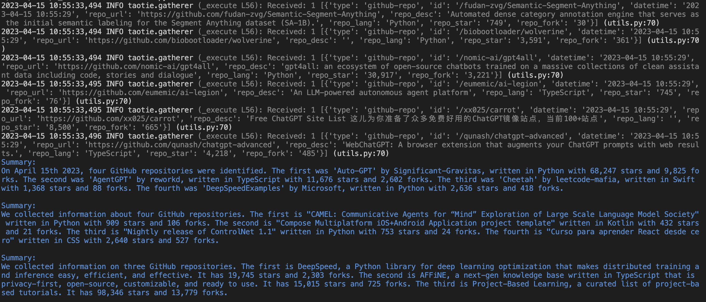
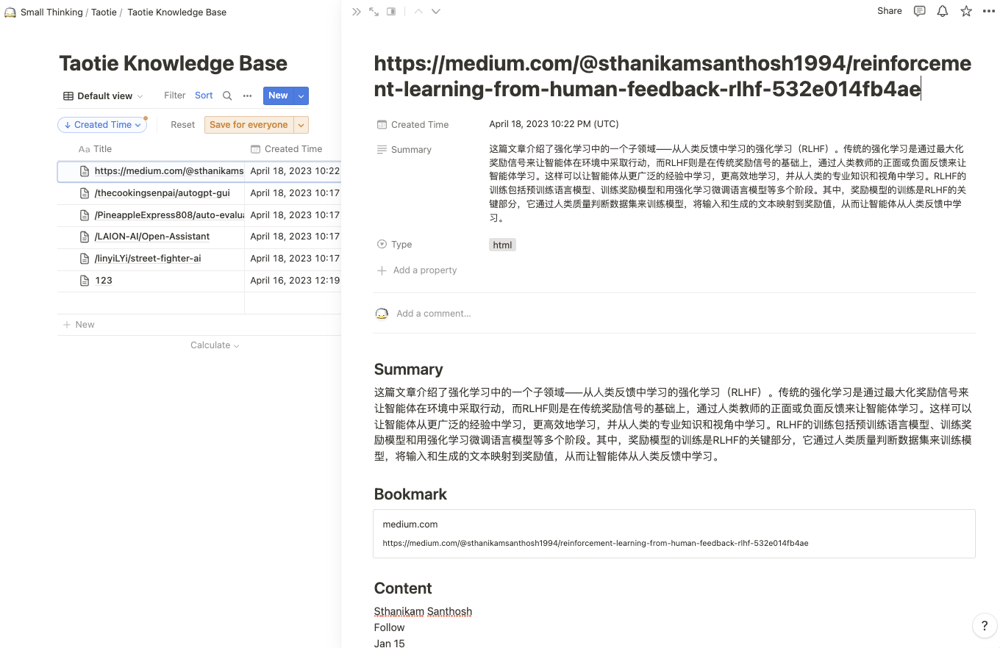
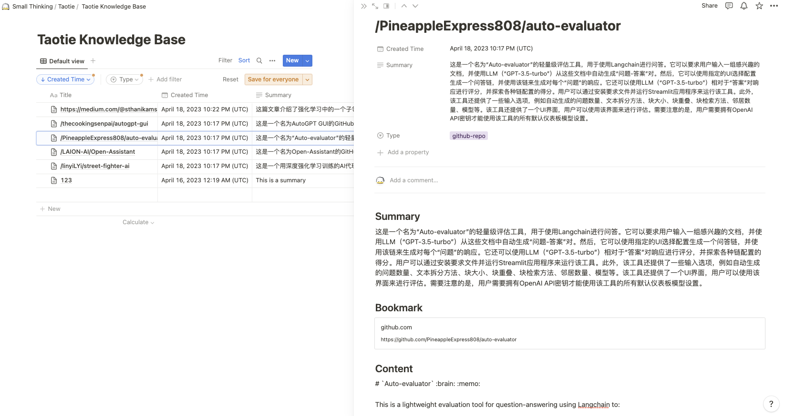

<p align="center">
    
</p>

# Tao Tie (饕餮)

Let Taotie be your helper to extract useful knowledge out of massive noisy information. It consists of three main components:

* **Sources**: These are the information sources that TaoTie can subscribe to. Currently, TaoTie supports Twitter, GitHub, and HTTP sources.
* **Consumers**: These are the agents that TaoTie uses to summarize the information. TaoTie can be integrated with any Language Model (LLM) agent, and only a thin wrapper is needed to integrate the agent with TaoTie.
* **Storage**: This is where TaoTie stores the summarized information. Currently, TaoTie supports Notion, but it can be configured to use other storage solutions as well.

## Architecture

Here's an overview of TaoTie's architecture:

<p align="center">
    
    <br>The architecture of TaoTie
</p>

## Example
Here's an example of how to use TaoTie to subscribe to Twitter, GitHub, and HTTP sources, summarize the information using an LLM agent, and store the summaries in Notion.

The example code can be found in [examples/summarize_to_notion/example.py](examples/summarize_to_notion/example.py).

### 1. Set up your environment

Create a .env file and add the necessary API tokens:

```bash
OPENAI_API_KEY=<your OpenAI API key>
TWITTER_BEARER_TOKEN=<your Twitter bearer token>  # Please follow https://developer.twitter.com/en/portal.

NOTION_TOKEN=<your Notion API token>  # Please follow https://developers.notion.com/docs/create-a-notion-integration.
NOTION_ROOT_PAGE_ID=<the ID of the page where you want to store the summaries>  # The id of the page where you want to dump the summary.
```

### 2. Build the example:
```bash
# Build the docker image
docker build -t summarize-to-notion -f examples/summarize_to_notion/Dockerfile .
```

### 3. Run the example:
```bash
docker run -it summarize-to-notion
```

When the program runs, it will subscribe to Twitter, GitHub, and HTTP sources, summarize the information using an LLM agent, and store the summaries in Notion. It will also set up an HTTP server listening on port 6543 to receive ad-hoc summarization requests. For example, you can use the following curl command to summarize a blog post:

```bash
curl -X POST -H "Content-Type: application/json" -d '{"url": "https://www.harmdevries.com/post/model-size-vs-compute-overhead"}' http://localhost:6543/api/v1/url
```

A more user friendly tool is not yet available. But you can use the [Postman](https://www.postman.com/) to send the request.

**Note: Please remember to stop the container after a while. Otherwise, your OPENAI bill will grow continously.**

### Output

<p align="center">
    
    <br>Output of the info summarizer example
</p>

In your notion, you can see the contents added.

<p align="center">
    
    <br>Summarized Web-page (Medium post)
</p>

<p align="center">
    
    <br>Summarized Github-repo (Github Trends)
</p>